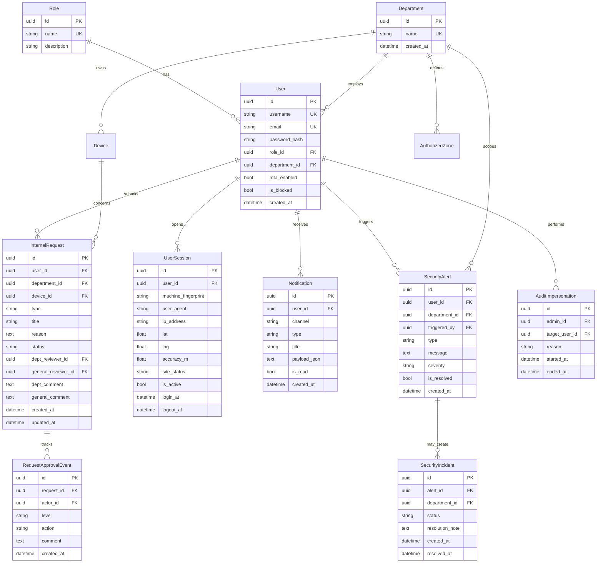
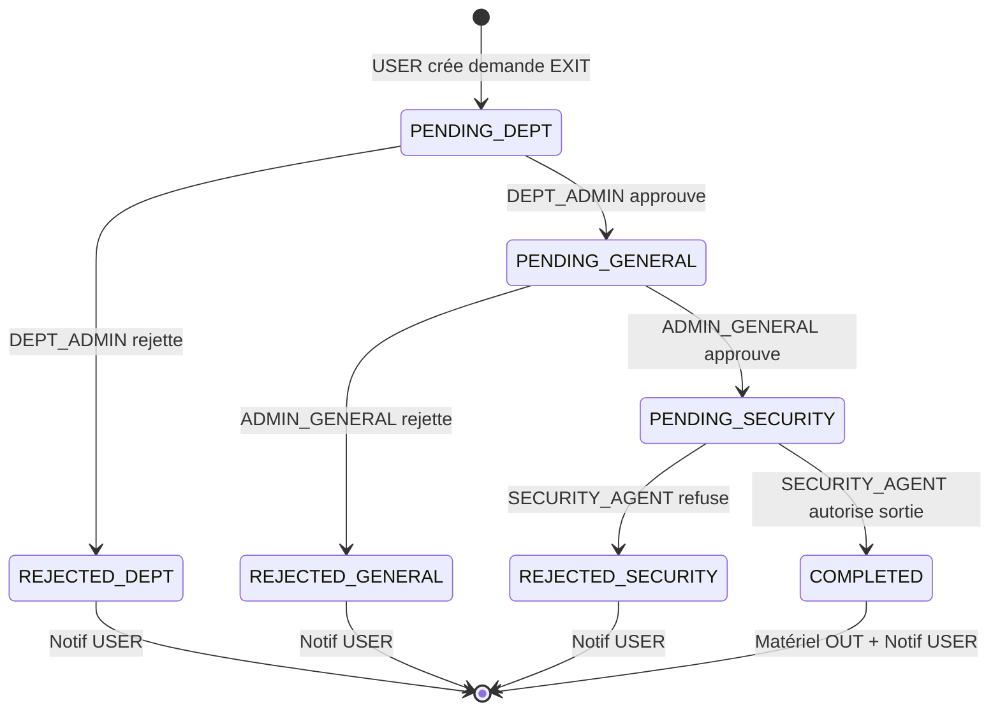
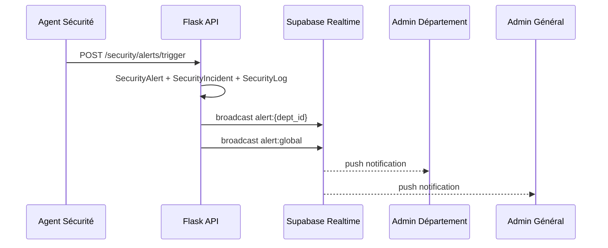
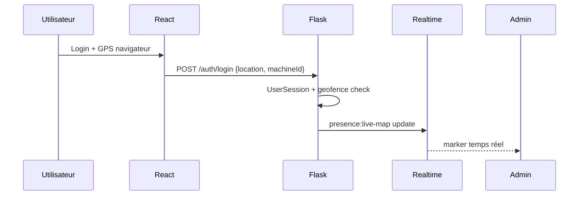

# Architecture SetH — Flux, Sécurité & Temps réel

> Stack cible : **Flask + SQLAlchemy (Supabase PostgreSQL)** · **React + Vite + Tailwind** · **Supabase Realtime** (WebSocket)

---

## 1. Schéma relationnel (ERD)



### Statuts des demandes (`InternalRequest.status`)

| Statut | Signification |
|--------|----------------|
| `PENDING_DEPT` | En attente Admin Département |
| `PENDING_GENERAL` | Validée dept → en attente Admin Général |
| `PENDING_SECURITY` | Validée admin → file agent sécurité |
| `COMPLETED` | Sortie matériel confirmée |
| `REJECTED_SECURITY` | Refus au poste de sécurité |
| `REJECTED_GENERAL` | Rejetée par Admin Général |
| `CANCELLED` | Annulée par l'utilisateur |

### Statut session (`UserSession.site_status`)

| Valeur | Règle |
|--------|--------|
| `ON_SITE` | Coordonnées dans une `AuthorizedZone` du département |
| `OFF_SITE` | Hors géofence |
| `UNKNOWN` | GPS indisponible |

---

## 2. Workflows

### 2.1 Demande de sortie matériel (3 niveaux + contrôle sécurité)



**Effets de bord à chaque transition :**
1. Insert `RequestApprovalEvent`
2. Insert `Notification` pour les acteurs concernés
3. Broadcast Realtime (`request:{id}`, `dept:{dept_id}`, `admin:global`)
4. Insert `SecurityLog` (audit)

### 2.2 Alerte sécurité (Agent)



### 2.3 Connexion & localisation (Snapchat-style)



---

## 3. Endpoints API principaux

### Auth & sessions

| Méthode | Route | Rôle | Description |
|---------|-------|------|-------------|
| POST | `/api/auth/login` | public | Login + GPS + fingerprint machine |
| POST | `/api/auth/logout` | auth | Clôture `UserSession` |
| GET | `/api/sessions/live` | DEPT_ADMIN, ADMIN_GENERAL | Flux présence temps réel |
| GET | `/api/sessions/me` | auth | Session courante |

### Demandes (workflow)

| Méthode | Route | Rôle | Body / Réponse |
|---------|-------|------|----------------|
| POST | `/api/requests` | USER | `{type, device_id?, title, reason}` → `{id, status: PENDING_DEPT}` |
| GET | `/api/requests/mine` | USER | Liste des demandes utilisateur |
| GET | `/api/requests/pending` | DEPT_ADMIN | Filtre `department_id` |
| GET | `/api/requests/pending/global` | ADMIN_GENERAL | `status=PENDING_GENERAL` |
| POST | `/api/requests/:id/approve` | DEPT_ADMIN / ADMIN_GENERAL | `{comment?}` |
| POST | `/api/requests/:id/reject` | DEPT_ADMIN / ADMIN_GENERAL | `{comment}` obligatoire |
| GET | `/api/requests/pending/security` | SECURITY_AGENT | File sorties `PENDING_SECURITY` |
| GET | `/api/requests/history/security` | SECURITY_AGENT | Historique contrôles |
| POST | `/api/requests/:id/confirm-exit` | SECURITY_AGENT | `{comment?}` → `COMPLETED`, device `OUT` |
| POST | `/api/requests/:id/deny-exit` | SECURITY_AGENT | `{comment}` → `REJECTED_SECURITY` |
| GET | `/api/requests/:id/timeline` | auth (scope) | Historique `RequestApprovalEvent` |

### Sécurité & alertes

| Méthode | Route | Rôle | Description |
|---------|-------|------|-------------|
| POST | `/api/security/alerts/trigger` | SECURITY_AGENT | Déclenche alerte + incident |
| GET | `/api/security/alerts` | DEPT_ADMIN, ADMIN_GENERAL | Alertes filtrées |
| PATCH | `/api/security/alerts/:id/resolve` | DEPT_ADMIN, ADMIN_GENERAL | Résolution |
| GET | `/api/security/incidents` | SECURITY_AGENT+ | Historique chronologique |

### Admin général & audit

| Méthode | Route | Rôle | Description |
|---------|-------|------|-------------|
| POST | `/api/admin/departments` | ADMIN_GENERAL | Créer département |
| PATCH | `/api/admin/users/:id/role` | ADMIN_GENERAL | Assigner rôle |
| POST | `/api/admin/audit/impersonate` | ADMIN_GENERAL | `{target_user_id, reason}` → JWT audit |
| POST | `/api/admin/audit/stop` | ADMIN_GENERAL | Fin impersonation |

### Middleware RBAC (existant + extensions)

```python
# backend/app/middleware/rbac.py
@role_required([RoleName.USER])
@role_required([RoleName.DEPT_ADMIN])
@role_required([RoleName.SUPER_ADMIN])
@role_required([RoleName.SECURITY_AGENT])

# backend/app/middleware/scope.py (à ajouter)
def department_scope_required(f):
    """DEPT_ADMIN : force department_id == requester.department_id"""
    
def audit_mode_guard(f):
    """Bloque mutations sensibles en mode impersonation sauf lecture"""
```

---

## 4. Stratégie temps réel

### Recommandation : **Supabase Realtime** (déjà PostgreSQL)

| Canal | Événement | Abonnés |
|-------|-----------|---------|
| `alerts:dept:{dept_id}` | `INSERT` SecurityAlert | Admin Département |
| `alerts:global` | alertes CRITICAL | Admin Général |
| `requests:dept:{dept_id}` | changement statut demande | Admin Département |
| `requests:global` | `PENDING_GENERAL` | Admin Général |
| `presence:map` | UserSession ON/OFF | Admin Général |
| `notifications:user:{user_id}` | Notification | Tous rôles |

**Alternative self-hosted :** Flask-SocketIO + Redis pub/sub (si pas Supabase).

**Frontend :** hook `useRealtimeChannel(channel, handler)` → Supabase client `channel.on('postgres_changes', ...)`.

---

## 5. Règles métier sécurité

1. **Isolation département** : DEPT_ADMIN ne voit que `department_id` = le sien.
2. **Double validation** : transition `PENDING_DEPT → PENDING_GENERAL` uniquement par DEPT_ADMIN du même dept.
3. **Rejet** : commentaire obligatoire ; notification immédiate à l'auteur.
4. **Audit mode** : JWT avec claim `impersonating_user_id` + log `AuditImpersonation` ; bannière UI rouge.
5. **Alerte agent** : crée `SecurityIncident` non résolu ; push dept + global.
6. **GPS login** : si `OFF_SITE` + matériel assigné → alerte optionnelle `OFF_SITE_LOGIN`.
7. **Rate limit** : max 10 demandes / user / jour.

---

## 6. Structure frontend (React + Tailwind)

```
frontend/src/
├── features/
│   ├── requests/
│   │   ├── RequestForm.tsx          # USER — nouvelle demande
│   │   ├── RequestList.tsx          # listes filtrées
│   │   └── RequestApprovalActions.tsx
│   ├── security/
│   │   ├── EmergencyAlertButton.tsx # AGENT
│   │   └── SecurityIncidentFeed.tsx
│   ├── admin/
│   │   ├── GlobalKpiPanel.tsx       # ADMIN_GENERAL
│   │   ├── AuditModeBanner.tsx
│   │   └── LivePresenceMap.tsx
│   └── shared/
│       ├── StatCard.tsx
│       ├── NotificationCenter.tsx
│       └── RoleGuard.tsx
├── hooks/
│   ├── useRealtime.ts
│   └── useAuditMode.ts
└── pages/
    ├── dashboards/
    │   ├── UserDashboardPage.tsx
    │   ├── DeptAdminDashboardPage.tsx
    │   ├── SuperAdminDashboardPage.tsx
    │   └── SecurityAgentDashboardPage.tsx
```

---

## 7. Mapping rôles existants SetH

| Spec métier | Constante backend | Dashboard |
|-------------|-------------------|-----------|
| Utilisateur Simple | `USER` | `UserDashboardPage` |
| Admin Département | `ADMIN_DEPT` | `DeptAdminDashboardPage` |
| Admin Général | `ADMIN_GENERAL` | `SuperAdminDashboardPage` |
| Agent Sécurité | `SECURITY_AGENT` | `SecurityAgentDashboardPage` |

---

## 8. Plan d'implémentation par phases

| Phase | Livrable |
|-------|----------|
| **P1** | Modèles `InternalRequest`, `Notification`, `UserSession` + migrations |
| **P2** | `workflow_service.py` + routes `/api/requests/*` |
| **P3** | Supabase Realtime + `useRealtime` frontend |
| **P4** | 4 dashboards feature-complete |
| **P5** | Mode Audit + Live Map admin |
